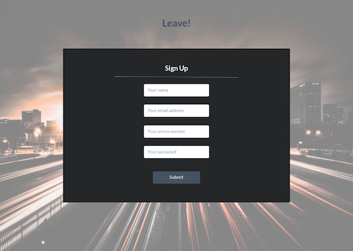
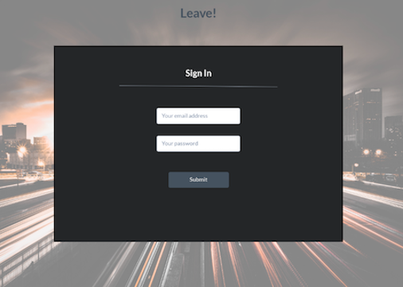
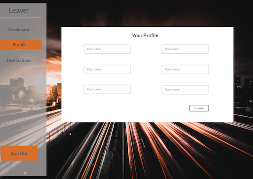
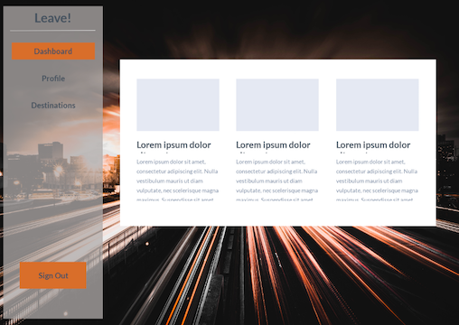

# Leave!

Leave! is an app that allows the user to signup and input their home address. The user should then create destinations and times they wish to reach those destinations. A text message will then be sent to the user 15 minutes prior to the time they should leave to reach their destination at the arrival time they specified. 
Leave! uses Google Maps and Google Distance Matrix APIs to ensure that the information is relevant and up-to-date. Twilio is used to send the text message to the phone number provided during sign up.

## Tech Requirements

* React
* Python and Django
* CSS & Reactstrap
* Javascript
* Resources- users and locations
* Auth
* Third party APIs: Twilio, Google maps, Google distance matrix

## Wireframes






## Trello Board
[Click to be redirected](https://trello.com/b/YndRvBUZ/group-proj-rk-bd-ab)

## What We Are Most Proud Of


## To Download and Run Locally
Fork a copy of this repo, make sure to run npm install to install all needed dependencies. also fork and clone the backend: [here](https://github.com/410dood/django-rest). Make sure to create a local database:
```
$ psql
> CREATE DATABASE leave;
> CREATE USER leaveuser WITH PASSWORD 'leave';
GRANT ALL PRIVILEGES ON DATABASE leave TO leaveuser;
> \q
```
Run the back end with python3 manage.py and the front end with npm start.

